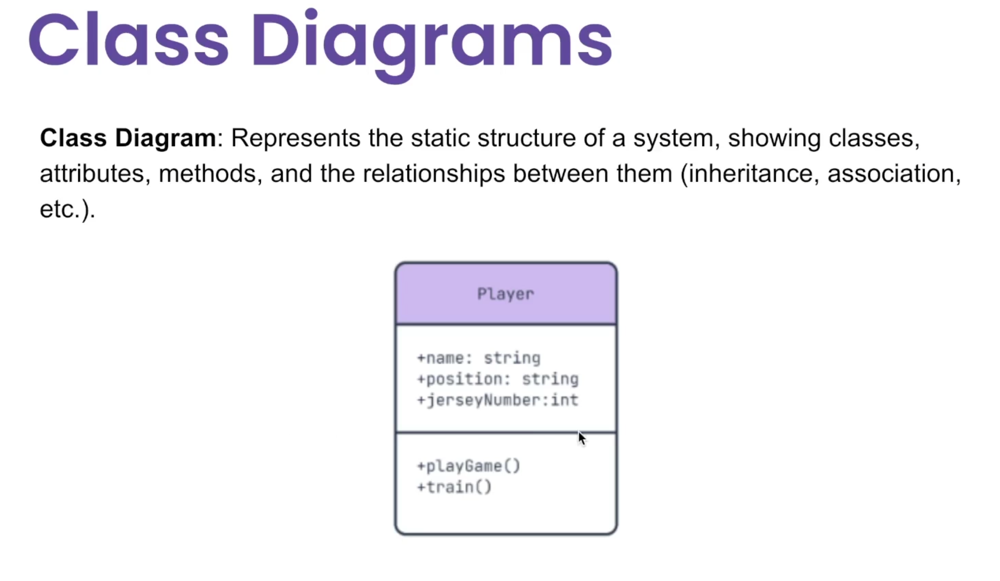
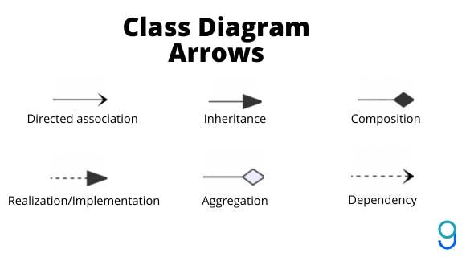
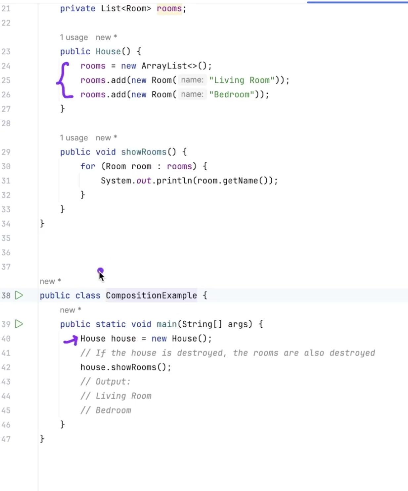
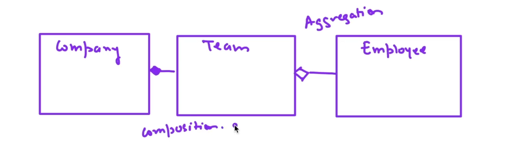

# Low Level System Design, Design Patterns and SOLID Principles

- The corresponding [GitHub repo](https://github.com/prateek27/design-patterns-java) for this course.
- The instructor will be using Java for the demonstrations, but feel free to use your language of choice throughout.

## Section 2: Basics of OOP

### Unified Modelling Language

Has nine core components:
1. Class: blueprint that defines names, attributes and methods for an object
2. Interface: A contract that defines the methods and attributes a class must implement.
3. Object: An instance of a class at runtime.
4. Association: A relationship between two classes, representing interaction between objects.
5. Inheritance
6. Composition: A stronger association where one object is part of another and cannot exist independently.
7. Aggregation: A weaker association where one object is part of another, but they can exist independently.
8. Dependency: One class relies on another, usually through method parameters, return types or temporary associations.
9. Realisation: A class implements the behaviour defined by an interface.

#### Class Diagram: How to represent the blueprint for a class





#### Composite relationship example

- You have a class for House and another class for Room.
- A house can have many rooms. But if the house object is destroyed, then the corresponding room objects should be destroyed too.
- Because rooms cannot exist without the House.
- This is achieved by instantiating the Room objects INSIDE the House object:



#### Aggregation vs Composition difference explained using Company, Team and Employee example:



- A team cannot exist without the company existing.
- An employee can exist as long as there is a company, even if there is no team.

### Refactor Guru Book

- Classes can only inherit from ONE super/parent class.
- However, a class can implement multiple different interfaces.
- Method resolution order (MRO) applies.

```
Summary from Refactoring Guru Book:

Dependency: Class А can be affected by changes in class B.

Association: Object А knows about object B. Class A depends on B.

Aggregation: Object А knows about object B, and consists of B. Class A depends on B.

Composition: Object А knows about object B, consists of B, and manages B’s life cycle. Class A depends on B.

Implementation: Class А defines methods declared in interface B. Objects A can be treated as B. Class A depends on B.

Inheritance: Class А inherits interface and implementation of class B but can extend it. Objects A can be treated as B. Class A depends on B.

```

#### What is a design pattern?

```
Design patterns are typical solutions to commonly occurring
problems in software design. They are like pre-made blue-
prints that you can customize to solve a recurring design prob-
lem in your code.
```

#### Why learn and use design patterns?

```
Design patterns are a toolkit of tried and tested solutions
to common problems in software design. Even if you never
encounter these problems, knowing patterns is still useful
because it teaches you how to solve all sorts of problems using
principles of object-oriented design.

Design patterns define a common language that you and your
teammates can use to communicate more efficiently. You can
say, “Oh, just use a Singleton for that,” and everyone will
understand the idea behind your suggestion. No need to
explain what a singleton is if you know the pattern and
its name.
```

## Section 3: Low-level software design principles

### 1. Encapsulate everything that varies

- Identify the aspects of your application that vary and separate them from what stays the same.
- The main goal of this principle is to minimize the effect caused by changes.

### 2. Program to an interface, not an implementation

```
The steps for doing this:

1.Determine what exactly one object needs from the other:
which methods does it execute?

2.Describe these methods in a new interface or abstract class.

3.Make the class that is a dependency implement this interface.

4.Now make the second class dependent on this interface rather
than on the concrete class. You still can make it work with
objects of the original class, but the connection is now much
more flexible.

This results to the implementation of the factory pattern.
```

### 3. Favour composition over inheritance

```
Inheritance has many limitations that reduce its viability:

•A subclass can’t reduce the interface of the superclass. You
have to implement all abstract methods of the parent class
even if you won’t be using them.

•When overriding methods you need to make sure that the
new behavior is compatible with the base one. It’s important
because objects of the subclass may be passed to any code
that expects objects of the superclass and you don’t want that
code to break.

•Inheritance breaks encapsulation of the superclass because
the internal details of the parent class become available to the
subclass. There might be an opposite situation where a pro-
grammer makes a superclass aware of some details of sub-
classes for the sake of making further extension easier.

•Subclasses are tightly coupled to superclasses. Any change in
a superclass may break the functionality of subclasses.

•Trying to reuse code through inheritance can lead to creat-
ing parallel inheritance hierarchies. Inheritance usually takes
place in a single dimension. But whenever there are two or
more dimensions, you have to create lots of class combina-
tions, bloating the class hierarchy to a ridiculous size.

Composition is the alternative to using inheritance.
```

## Section 4: SOLID Principles

S - Single Responsibility Principle
O - Open-Closed Principle
L - Liskov Substitution Principle
I - Interface Segregation Principle
D - Dependency Inversion Principle

### Single Responsibility Principle

- One class should only have one responsibility.
- Example: User class should only handle user-related logic.
- DB related logic should be handled by its own separate class

