# Low Level System Design, Design Patterns and SOLID Principles

- The corresponding [GitHub repo](https://github.com/prateek27/design-patterns-java) for this course.
- The instructor will be using Java for the demonstrations, but feel free to use your language of choice throughout.

## Section 2: Basics of OOP

### Unified Modelling Language

Has nine core components:
1. Class: blueprint that defines names, attributes and methods for an object
2. Interface: A contract that defines the methods and attributes a class must implement.
3. Object: An instance of a class at runtime.
4. Association: A relationship between two classes, representing interaction between objects.
5. Inheritance
6. Composition: A stronger association where one object is part of another and cannot exist independently.
7. Aggregation: A weaker association where one object is part of another, but they can exist independently.
8. Dependency: One class relies on another, usually through method parameters, return types or temporary associations.
9. Realisation: A class implements the behaviour defined by an interface.

#### Class Diagram: How to represent the blueprint for a class


#### Composite relationship example

- You have a class for House and another class for Room.
- A house can have many rooms. But if the house object is destroyed, then the corresponding room objects should be destroyed too.
- Because rooms cannot exist without the House.
- This is achieved by instantiating the Room objects INSIDE the House object:


#### Aggregation vs Composition difference explained using Company, Team and Employee example:


- A team cannot exist without the company existing.
- An employee can exist as long as there is a company, even if there is no team.

### Refactor Guru Book

- Classes can only inherit from ONE super/parent class.
- However, a class can implement multiple different interfaces.
- Method resolution order (MRO) applies.

```
Summary from Refactoring Guru Book:

Dependency: Class А can be affected by changes in class B.

Association: Object А knows about object B. Class A depends on B.

Aggregation: Object А knows about object B, and consists of B. Class A depends on B.

Composition: Object А knows about object B, consists of B, and manages B’s life cycle. Class A depends on B.

Implementation: Class А defines methods declared in interface B. Objects A can be treated as B. Class A depends on B.

Inheritance: Class А inherits interface and implementation of class B but can extend it. Objects A can be treated as B. Class A depends on B.

```

#### What is a design pattern?

```
Design patterns are typical solutions to commonly occurring
problems in software design. They are like pre-made blue-
prints that you can customize to solve a recurring design prob-
lem in your code.
```

#### Why learn and use design patterns?

```
Design patterns are a toolkit of tried and tested solutions
to common problems in software design. Even if you never
encounter these problems, knowing patterns is still useful
because it teaches you how to solve all sorts of problems using
principles of object-oriented design.

Design patterns define a common language that you and your
teammates can use to communicate more efficiently. You can
say, “Oh, just use a Singleton for that,” and everyone will
understand the idea behind your suggestion. No need to
explain what a singleton is if you know the pattern and
its name.
```

## Section 3: Low-level software design principles

### 1. Encapsulate everything that varies

- Identify the aspects of your application that vary and separate them from what stays the same.
- The main goal of this principle is to minimize the effect caused by changes.

### 2. Program to an interface, not an implementation

```
The steps for doing this:

1.Determine what exactly one object needs from the other:
which methods does it execute?

2.Describe these methods in a new interface or abstract class.

3.Make the class that is a dependency implement this interface.

4.Now make the second class dependent on this interface rather
than on the concrete class. You still can make it work with
objects of the original class, but the connection is now much
more flexible.

This results to the implementation of the factory pattern.
```

### 3. Favour composition over inheritance

```
Inheritance has many limitations that reduce its viability:

•A subclass can’t reduce the interface of the superclass. You
have to implement all abstract methods of the parent class
even if you won’t be using them.

•When overriding methods you need to make sure that the
new behavior is compatible with the base one. It’s important
because objects of the subclass may be passed to any code
that expects objects of the superclass and you don’t want that
code to break.

•Inheritance breaks encapsulation of the superclass because
the internal details of the parent class become available to the
subclass. There might be an opposite situation where a pro-
grammer makes a superclass aware of some details of sub-
classes for the sake of making further extension easier.

•Subclasses are tightly coupled to superclasses. Any change in
a superclass may break the functionality of subclasses.

•Trying to reuse code through inheritance can lead to creat-
ing parallel inheritance hierarchies. Inheritance usually takes
place in a single dimension. But whenever there are two or
more dimensions, you have to create lots of class combina-
tions, bloating the class hierarchy to a ridiculous size.

Composition is the alternative to using inheritance.
```

## Section 4: SOLID Principles

S - Single Responsibility Principle
O - Open-Closed Principle
L - Liskov Substitution Principle
I - Interface Segregation Principle
D - Dependency Inversion Principle

- Its impossible to incorporate all 5 of these principles into a single software product.
- Be pragmatic about your design decisions and choose apropriate ones for the given problem.

### Single Responsibility Principle

```
    A class should have just one reason to change.
```
- One class should only have one responsibility.
- Example: User class should only handle user-related logic.
- DB related logic should be handled by its own separate class
- Each class should be responsible for a single part of the functionality provided by a given software.
- SRP can be used as a check to see if a class has become too complicated, and needs to be broken down into smaller classes.

```
If a class does too many things, you have to
change it every time one of these things changes. While doing
that, you’re risking breaking other parts of the class which you
didn’t even intend to change.
```
### Open/Closed Principle

Classes should be **open** for extension, but **closed** for modification.

- This principle helps prevent existing code from breaking when you implement new features.
- This can be achieved by inheritance - child classes to modify/extend the behaviour of the parent class.
- Or, the better approach, **use composition** - delegate the variable/extensible logic to other objects.

```
This principle isn’t meant to be applied for all changes to a
class. If you know that there’s a bug in the class, just go on and
fix it; don’t create a subclass for it. A child class shouldn’t be
responsible for the parent’s issues.
```
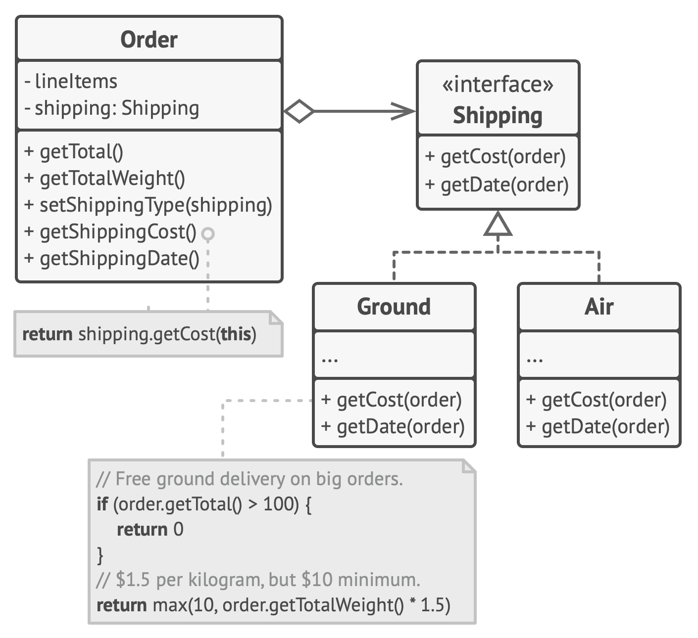

- In this example: Order object is no longer directly dependent on a Shipping method.
- As long as Shipping methods all possess getCost and getDate methods, more Shipping strategies can be added in the future.
- While preserving the Order object.

### Liskov Substitution Principle

```
When extending a class, remember that you should be
able to pass objects of the subclass in place of objects of
the parent class without breaking the client code.
```
- The subclass should remain compatible with consumers of the parent class.
- Even when methods are over-ridden in the child class, the base behaviour of the method should remain the same.

```
This concept is critical when developing libraries and frameworks because
your classes are going to be used by other people whose code you can’t directly access and change.
```

- Unlike the other SOLID principles, which are open to some level of interpretation.
- LSP has a set of rules that must be adhered to.

#### LSP Rules

**1. Parameter types in a method of a subclass should match or be more abstract than parameter types in the method of the superclass.**

```
Good: Say you created a subclass that overrode the method
so that it can feed any animal (a superclass of cats):
feed(Animal c) . Now if you pass an object of this subclass
instead of an object of the superclass to the client code,
everything would still work fine. The method can feed all
animals, so it can still feed any cat passed by the client.

Bad: You created another subclass and restricted the feed-
ing method to only accept Bengal cats (a subclass of cats):
feed(BengalCat c). Since the method can only feed a specific breed
of cats, it won’t serve generic cats passed by the client,
breaking all related functionality.
```

**2. The return type in a method of a subclass should match or be a subtype of the return type in the method of the superclass.**

- This is the inverse of the rule for method parameters.
```
Good: A subclass overrides the method as follows:
buyCat(): BengalCat . The client gets a Bengal cat, which is
still a cat, so everything is okay.

Bad: A subclass overrides the method as follows:
buyCat(): Animal . Now the client code breaks since it
receives an unknown generic animal (an alligator? a bear?)
that doesn’t fit a structure designed for a cat.
```

**3. A method in a subclass shouldn’t throw types of exceptions which the base method isn’t expected to throw.**

```
This rule comes
from the fact that try-catch blocks in the client code target
specific types of exceptions which the base method is likely to
throw. Therefore, an unexpected exception might slip through
the defensive lines of the client code and crash the entire
application.
```

**4. A subclass should NOT strengthen pre-conditions.**

```
For example,
the base method has a parameter with type int . If a sub-
class overrides this method and requires that the value of an
argument passed to the method should be positive (by throw-
ing an exception if the value is negative), this strengthens the
pre-conditions. The client code, which used to work fine when
passing negative numbers into the method, now breaks if it
starts working with an object of this subclass.
```

**5. A subclass should NOT weaken post-conditions.**

```
Say you have a
class with a method that works with a database. A method of
the class is supposed to always close all opened database con-
nections upon returning a value.

You created a subclass and changed it so that database con-
nections remain open so you can reuse them. This will break client-side behaviour.
```

**6. Invariants of a superclass must be preserved.**

```
The rule on invariants is the easiest to violate because you
might misunderstand or not realize all of the invariants of
a complex class. Therefore, the safest way to extend a class
is to introduce new fields and methods, and not mess with
any existing members of the superclass. Of course, that’s not
always doable in real life.
```

**7. A subclass shouldn’t change values of private fields of the superclass.**


### Interface Segregation Principle

```
Clients shouldn’t be forced to depend on methods they do not use.
```

- Try to make your interfaces narrow enough that client classes don’t have to implement behaviors they don’t need.
- Class inheritance lets a class have just one superclass, but it doesn’t limit the number of interfaces that the class can implement at the same time.
- Hence, there’s no need to cram tons of unrelated methods to a single interface. Break it down into several more refined interfaces — you can implement them all in a single class if needed.

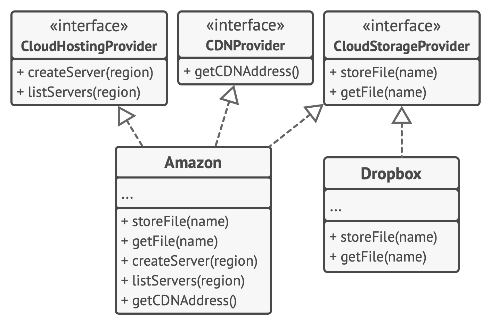

- In the above example, Amazon implements three interfaces, while Dropbox the one that it needs.

```
As with the other principles, you can go too far with this one.
Don’t further divide an interface which is already quite spe-
cific. Remember that the more interfaces you create, the more
complex your code becomes. Keep the balance.
```

### Dependency Inversion Principle

```
High-level classes shouldn’t depend on low-level classes. Both should depend on abstractions. 
Abstractions shouldn’t depend on details. Details should depend on abstractions.
```

Classes can be of two types:

- **Low-level classes** implement basic operations such as working with a disk, transferring data over a network, connecting to a database, etc.
- **High-level classes** contain complex business logic that directs low-level classes to do something.

- Make high-level classes *dependent* on an interface or interfaces.
- Make the low-level classes *implement* the interface(s).
- This makes the low-level classes dependent on the high-level ones, thus inverting the dependency!

```
The dependency inversion principle often goes along with the
open/closed principle: you can extend low-level classes to use
with different business logic classes without breaking existing
classes.
```

- Before: High-level dependent on low-level:

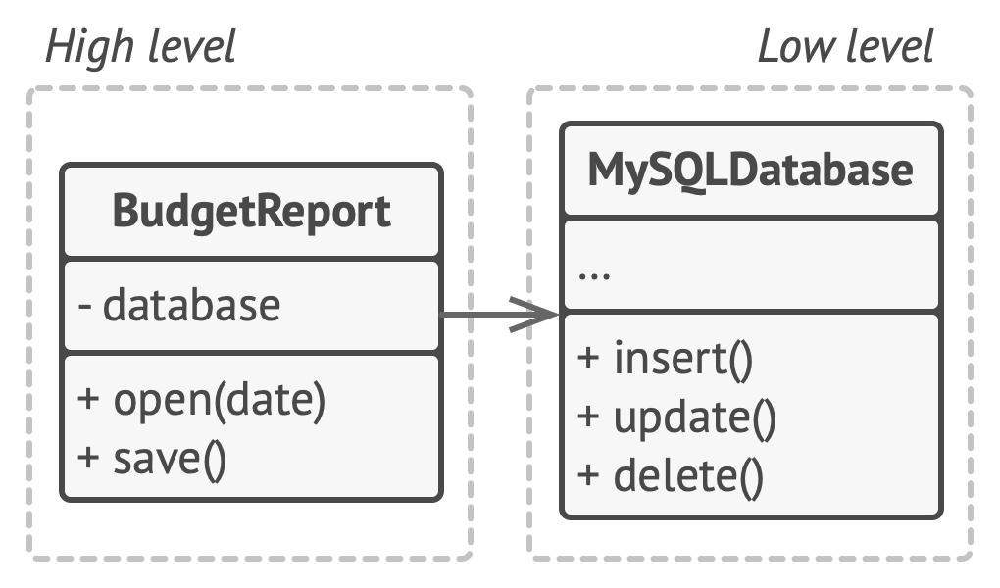

- After: With interface, low-level is not dependent on high-level abstractions

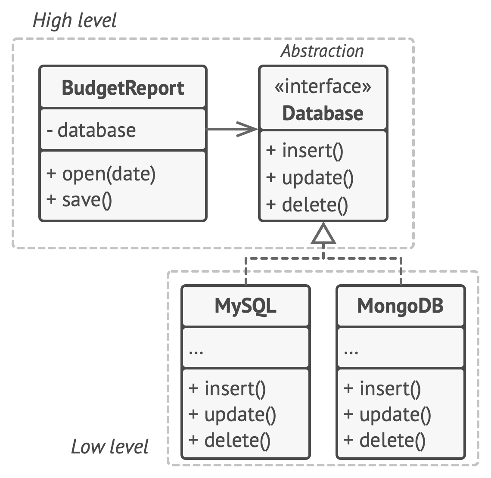


## Section 5: Creational Design Patterns

Five creational patterns will be covered:

1. **Factory Method**: Provides an interface for creating objects in a superclass, but allows subclasses to alter the type of object that will be created.
2. **Abstract Factory**: Produce families of related objects without specifiying their concrete classes.
3. **Builder**: Construct complex objects step-by-step. Can produce different representations of an object using the same construction code.
4. **Prototype**: Copy existing objects without making your code dependent on their classes.
5. **Singleton**: Ensure that a class only has one instance, while providing global access to this instance.

### 1. Factory Method

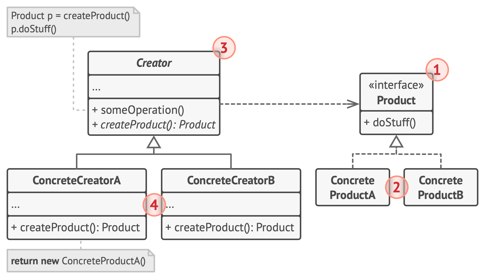

- The objects returned by a factory method are often called *products*.
- The **Product** declares the interface, which is common to all objects that can be produced by the creator and its subclasses.
- **Concrete Products** are different implementations of the product interface.
  - In the logistics example: shipping via ship and via truck are two different concrete products.
- The **Creator** class declares the *factory method* that returns new product objects. It’s important that the return type of this method matches the product interface.
  - In the example above, they should all possess the method doStuff()

```
Note, despite its name, product creation is not the primary
responsibility of the creator. Usually, the creator class already
has some core business logic related to products. The factory
method helps to decouple this logic from the concrete prod-
uct classes. Here is an analogy: a large software development
company can have a training department for programmers.
However, the primary function of the company as a whole is
still writing code, not producing programmers.
```

- **Concrete Creators** override the base factory method so it returns a different type of product.
- Example: Creating Dialog box with an interactive button, regardless of OS:

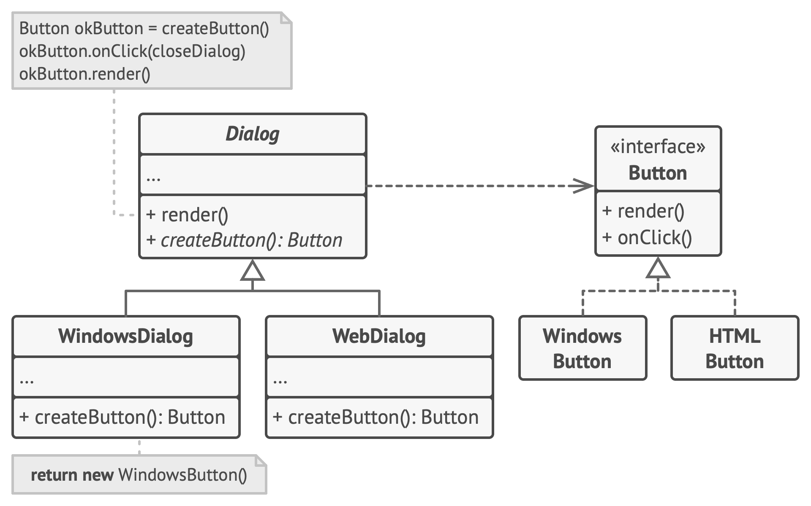

- See page 81 for pseudocode.

#### When to use the factory method in a creator class

```
Use the Factory Method when you don’t know beforehand the
exact types and dependencies of the objects your code should
work with.

Use the Factory Method when you want to provide users of
your library or framework with a way to extend its internal
components.

Use the Factory Method when you want to save system
resources by reusing existing objects instead of rebuilding
them each time. Existing objects can be cached and reused.
```

#### Pros and Cons

```
Pros:
You avoid tight coupling between the creator and the concrete
products.

Single Responsibility Principle. You can move the product cre-
ation code into one place in the program, making the code eas-
ier to support.

Open/Closed Principle. You can introduce new types of products
into the program without breaking existing client code.

Cons:
The code may become more complicated since you need to
introduce a lot of new subclasses to implement the pattern.
The best case scenario is when you’re introducing the pattern
into an existing hierarchy of creator classes.
```

### 2. Abstract Factory

Abstract Factory specializes in creating families of related objects. It returns the product immediately.

Step 1: Declare explicit interfaces for each distinct product in the product family
Step 2: Declare the Abstract Factory—an interface with a list of creation methods for all products that are part of the product family
    - These methods must return abstract product types represented by the interfaces we extracted previously.
Step 3: For each variant of a product family, we create a separate factory class based on the AbstractFactory interface.

```
A factory is a class that returns products of a particular kind. For example, the
ModernFurnitureFactory can only create ModernChair, ModernSofa and ModernCoffeeTable objects.
```

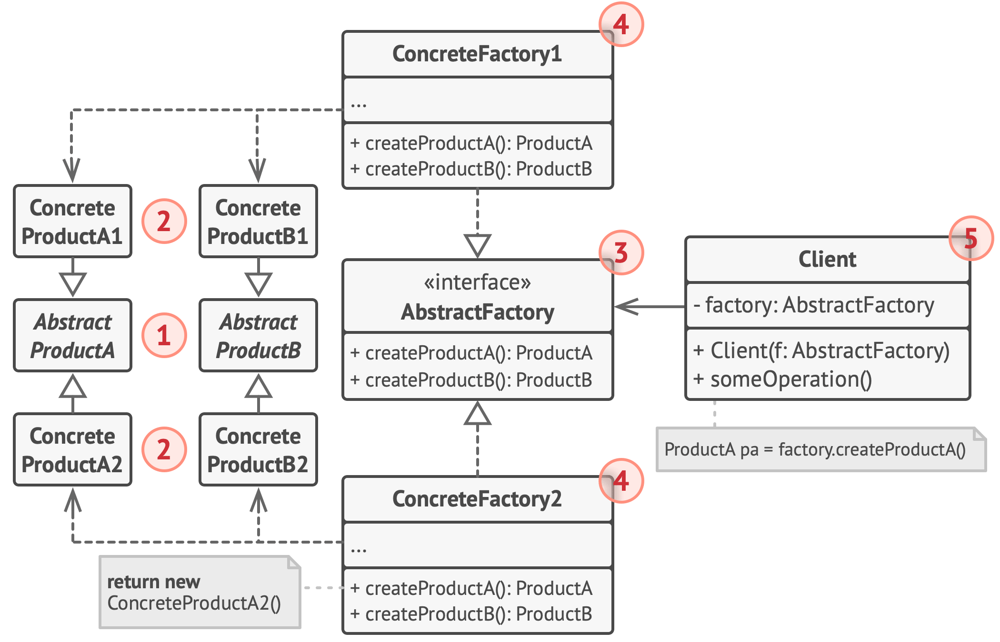

1. **Abstract Products** declare interfaces for a set of distinct but related products which make up a product family.
2. **Concrete Products** are various implementations of abstract products, grouped by variants. Each abstract product (chair/sofa) must be implemented in all given variants (Victorian/Modern).
3. The Abstract Factory interface declares a set of methods for creating *each* of the abstract products.
4. Concrete Factories implement creation methods of the abstract factory. Each concrete factory corresponds to a specific variant of products and creates only those product variants. That is, VictorianFactory will only create victorian furniture.
5. The Client can work with any concrete factory/product variant, as long as it communicates with their objects via abstract interfaces.

#### GUI factory example

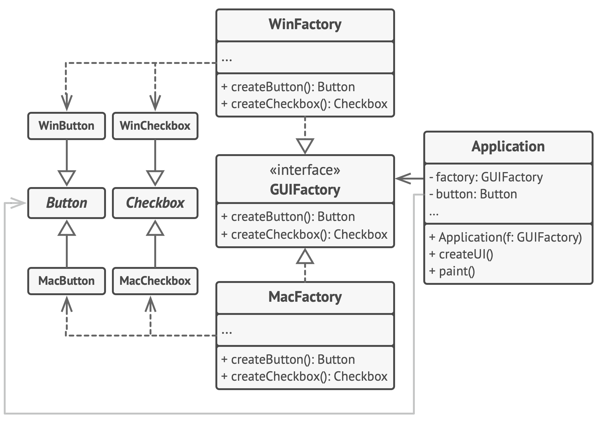

- The pseudocode is on page 99.

#### When to use abstract factory

```
Use the Abstract Factory when your code needs to work with 
various families of related products, but you don’t want it to
depend on the concrete classes of those products—they might
be unknown beforehand or you simply want to allow for future
extensibility.

Consider implementing the Abstract Factory when you have
a class with a set of Factory Methods that blur its primary
responsibility.

The Factory that is instantiated is dependent on the application configuration.
```

#### Pros and cons

```
Pros

You can be sure that the products you’re getting from a factory are compatible with each other.

You avoid tight coupling between concrete products and client code.

Single Responsibility Principle. You can extract the product creation code into one place, making the code easier to support.

Open/Closed Principle. You can introduce new variants of products without breaking existing client code.

Cons

The code may become more complicated than it should be, since a lot of new interfaces and classes are introduced along
with the pattern.
```

### 3. Builder

**Builder** is a creational design pattern that lets you construct complex objects step by step. The pattern allows you to produce different types and representations of an object using the same construction code.

- The Builder doesn’t allow other objects to access the product while it’s being built.
- You can call only those steps that are necessary for producing a particular configuration of an object.
- You can have different builder classes that perform the same build steps, but create different products.
  - One builder only uses wood and glass.
  - Another builder only uses stone and iron.
  - Another builder only builds with gold and diamonds.
- If you tell each builder to create a house with 4 walls, 4 windows and a door, the product from each builder would be different.

The **Director** class is an orchestrator of the build steps.
- The director class defines the order in which to execute the building steps, while the builder provides the implementation for those steps.
- Having directors is not necessary, but it improves code reusablity by having construction routines pre-written.

```
In addition, the director class completely hides the details
of product construction from the client code. The client only
needs to associate a builder with a director, launch the con-
struction with the director, and get the result from the builder.
```

Structure of the builder pattern

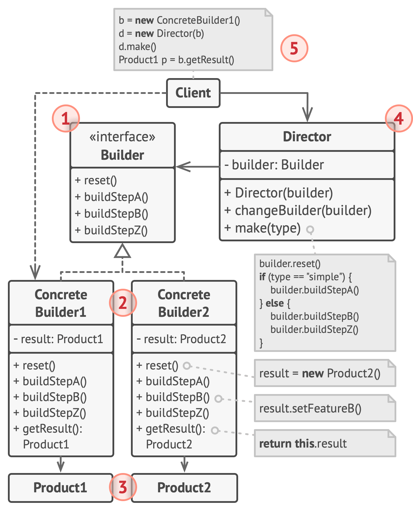

1. The **Builder** interface declares product construction steps that are common to all types of builders.
2. **Concrete Builders** provide different implementations of the construction steps. Concrete builders *may produce products that don’t follow the common interface.*
3. **Products** are resulting objects. Products constructed by different builders don’t have to belong to the same class hierarchy or interface.
4. The **Director** class defines the order in which to call construction steps, so you can create and reuse specific configurations of products.
5. The **Client** must associate one of the builder objects with the director. Usually, it’s done just once, via parameters of the director’s constructor. Then the director uses that builder object for all further construction.

- The final product should be obtained from the Builder class, not the Director
```
The final part is fetching the resulting object. A metal car and a
paper manual, although related, are still very different things.
We can’t place a method for fetching results in the direc-
tor without coupling the director to concrete product class-
es. Hence, we obtain the result of the construction from the
builder which performed the job.
```

- Pseudocode for the CarBuilder example is on page 115.

#### When to use builder pattern?

```
Use the Builder pattern to get rid of a “telescoping constructor”.
The Builder pattern lets you build objects step by step, using
only those steps that you really need. After implementing the
pattern, you don’t have to cram dozens of parameters into your
constructors anymore.

Use the Builder pattern when you want your code to be able to
create different representations of some product (for example,
stone and wooden houses).

Use the Builder to construct Composite trees or other complex
objects.
```

```
Don’t forget about implementing a method for fetching the
result of the construction. The reason why this method can’t
be declared inside the builder interface is that various builders
may construct products that don’t have a common interface.
Therefore, you don’t know what would be the return type for
such a method. However, if you’re dealing with products from
a single hierarchy, the fetching method can be safely added to
the base interface.
```

- The client instantiates the builder and the director. Then passes the builder to the director for orchestration.

#### Pros and cons

```
Pros:

You can construct objects step-by-step, defer construction
steps or run steps recursively.

You can reuse the same construction code when building vari-
ous representations of products.

Single Responsibility Principle. You can isolate complex con-
struction code from the business logic of the product.

Cons:
The overall complexity of the code increases since the pattern
requires creating multiple new classes.
```

### 4. Prototype

Prototype is a creational design pattern that lets you copy existing objects without making your code dependent on their classes.

- The Prototype pattern delegates the cloning process to the actual objects that are being cloned.
- The pattern declares a common interface for all objects that support cloning. This interface lets you clone an object *without coupling your code* to the class of that object.
- Usually, such an interface contains just a single clone method.
- The method creates an object of the current class and carries over all of the field values of the old object into the new one. You can even copy private fields because most programming languages let objects access private fields of other objects that belong to the same class.

```
An object that supports cloning is call a prototype.

Here’s how it works: you create a set of objects, configured in
various ways. When you need an object like the one you’ve
configured, you just clone a prototype instead of constructing
a new object from scratch.
```


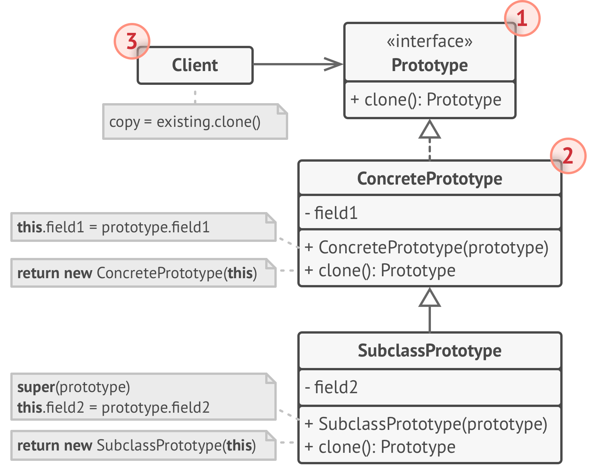

1. The **Prototype** interface declares the cloning methods. In most cases, it’s a single clone method.
2. The **Concrete Prototype** class implements the cloning method. In addition to copying the original object’s data to the clone, this method may also handle some edge cases of the cloning process related to cloning linked objects, untangling recursive dependencies, etc.
3. The **Client** can produce a copy of any object that follows the prototype interface.

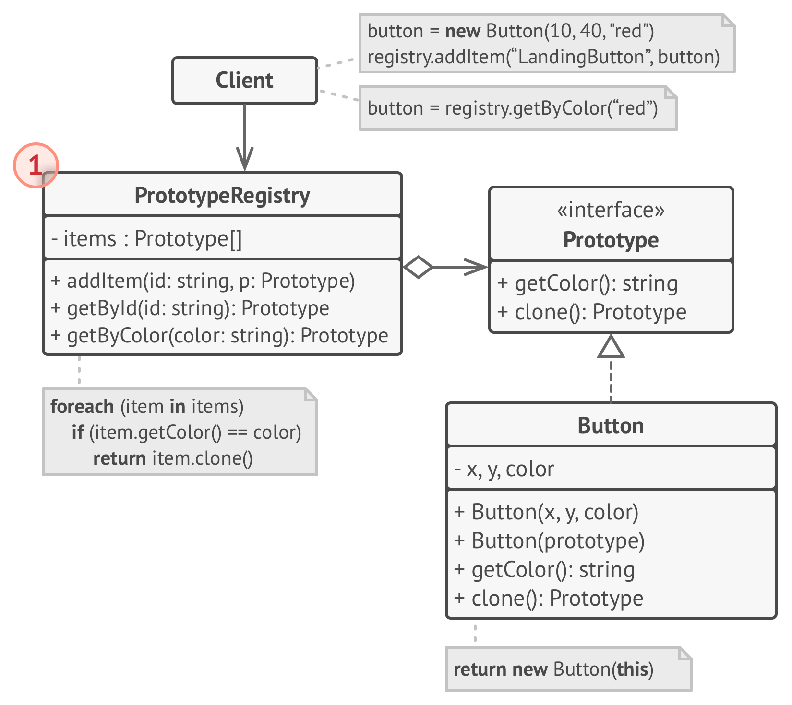

```
The Prototype Registry provides an easy way to access fre-
quently-used prototypes. It stores a set of pre-built objects
that are ready to be copied. The simplest prototype registry
is a name → prototype hash map.
```

**If your programming language doesn’t support method overloading, you won’t be able to create a separate “prototype”constructor.**
- In Python, you have to use the copy.deepcopy() method to create a copy of an existing object.
- Also need to think about circular references, which adds to the complexity of implementing the prototype pattern.

#### When to use Prototype pattern

```
Use the Prototype pattern when your code shouldn’t depend
on the concrete classes of objects that you need to copy.

Use this pattern when you want to reduce the number of subclasses 
that only differ in the way they initialize their respective objects.
```

#### Pros and cons

```
Pros:

You can clone objects without coupling to their concrete classes.

You can get rid of repeated initialization code in favor of cloning pre-built prototypes.

You can produce complex objects more conveniently.

You get an alternative to inheritance when dealing with configuration presets for complex objects.

Cons:

Cloning complex objects that have circular references might be very tricky.
```

```
Designs that make heavy use of Composite and Decorator can
often benefit from using Prototype. Applying the pattern lets
you clone complex structures instead of re-constructing them
from scratch.
```


### 5. Singleton

Singleton is a creational design pattern that lets you ensure that a class has only one instance, while providing a global access point to this instance.

```
Imagine that you created an object, but
after a while decided to create a new one. Instead of receiving
a fresh object, you’ll get the one you already created.

Note that this behavior is impossible to implement with a regular constructor 
since a constructor call must always return a new object by design.

Just like a global variable, the Singleton pattern lets you access some object 
from anywhere in the program. However, it also protects that instance from being 
overwritten by other code.
```

- Make the default constructor *private*, to prevent other objects from using the new operator with the Singleton class.
- Create a static creation method that acts as a constructor. Under the hood, this method calls the private constructor to create an object and saves it in a static field. All following calls to this method return the cached object.

Singleton structure:

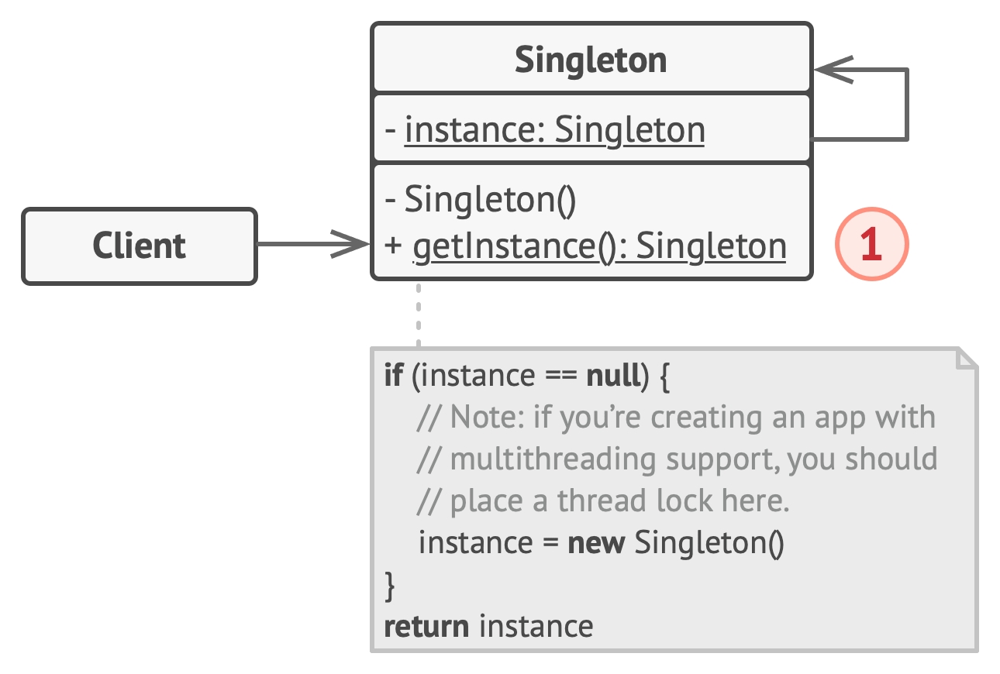

- The Singleton class declares the static method getInstance that returns the same instance of its own class.
- Establishing a singleton correctly requires using a mutex, ie, a thread lock.

```
16  // The static method that controls access to the singleton
17  // instance.
18  public static method getInstance() is
19      if (Database.instance == null) then
20          acquireThreadLock() and then
21              // Ensure that the instance hasn't yet been
22              // initialized by another thread while this one
23              // has been waiting for the lock's release.
24          if (Database.instance == null) then
25              Database.instance = new Database()
26
        return Database.instance
```

- Without a threadlock, multiple thread could be fighting to establish the singleton, leading to race conditions and unexpected behaviour.

#### When to use singleton

```
Use the Singleton pattern when a class in your program should
have just a single instance available to all clients; for exam-
ple, a single database object shared by different parts of the
program.

Use the Singleton pattern when you need stricter control over
global variables.
```

#### Pros and cons

```
Pros

You can be sure that a class has only a single instance.

You gain a global access point to that instance.

The singleton object is initialized only when it’s requested for the first time.

Cons

Violates the Single Responsibility Principle. The pattern solves two problems at the time.

The Singleton pattern can mask bad design, for instance, when the components of the program know too much about each other.

The pattern requires special treatment in a multithreaded environment so that multiple threads won’t create a singleton object several times.

It may be difficult to unit test the client code of the Singleton because many test frameworks rely on inheritance when producing mock objects. Since the constructor of the singleton class is private and overriding static methods is impossible in most languages, you will need to think of a creative way to mock the singleton. Or just don’t write the tests. Or don’t use the Singleton pattern.
```

## Section 6: Structural Design Patterns

Seven structural design patterns will be covered in this book:

1. Adapter
2. Bridge
3. Composite
4. Decorator
5. Facade
6. Flyweight
7. Proxy

### 1. Adapter

- Also known as a Wrapper.
- Adapter is a structural design pattern that allows objects with *incompatible interfaces* to collaborate.

```
Adapters can not only convert data into various formats but
can also help objects with different interfaces collaborate.
Here’s how it works:

1.The adapter gets an interface, compatible with one of the existing objects.

2.Using this interface, the existing object can safely call the adapter’s methods.

3.Upon receiving a call, the adapter passes the request to the second object, but in a format and order that the second object expects.

Sometimes it’s even possible to create a two-way adapter that can convert the calls in both directions. This is done by creating a class adapter, rather than an object adapter.
```

#### Object adapter

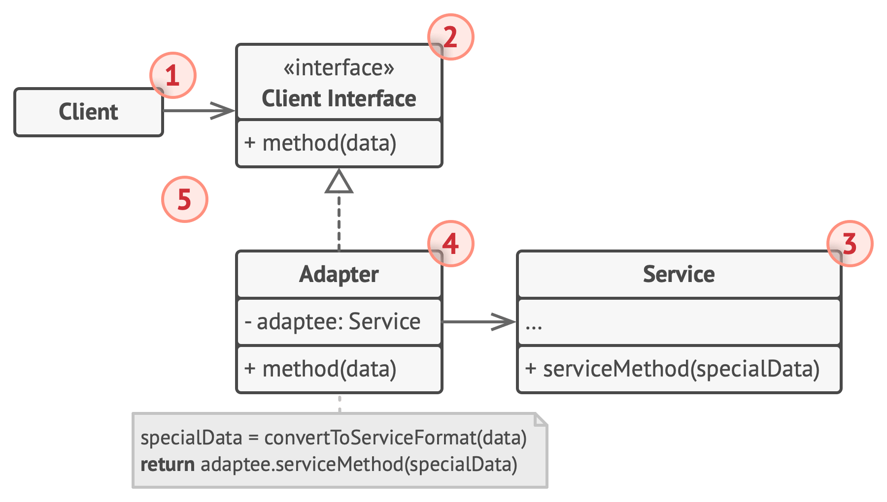

1. **The Client** is a class that contains the existing business logic of the program.
2. **The Client** Interface describes a protocol that other classes must follow to be able to collaborate with the client code.
3. **The Service** is some useful class (usually 3rd-party or legacy). The client can’t use this class directly because it has an incompatible interface.
4. **The Adapter** is a class that’s able to work with both the client and the service: it implements the client interface, while wrapping the service object. The adapter receives calls from the client via the client interface and translates them into calls to the wrapped service object in a format it can understand.

#### Class adapter

- This type of adapter can *only* be created in programming languages where one class can inherit from multiple classes.
- Python allows for multiple inheritance, and the order of inheritance is determined by the **method resolution order.**
- MRO can be accessed for an object with the \_\_mro\_\_ method.
- **The super() function: When using super(), Python doesn't necessarily call the "parent"—it calls the next class in the MRO list. This is a common "gotcha" that allows all classes in a complex hierarchy to be initialized correctly.**

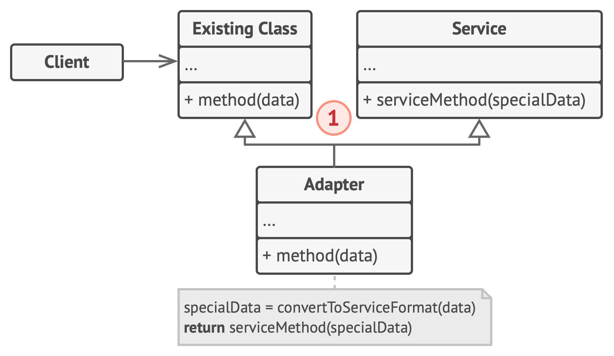

- The Class Adapter doesn’t need to wrap any objects because it inherits behaviors from both the client and the service. The adaptation happens within the overridden methods. The resulting adapter can be used in place of an existing client class.

#### When to use adapter pattern

```
Use the Adapter class when you want to use some existing
class, but its interface isn’t compatible with the rest of
your code.

Use the pattern when you want to reuse several existing sub-
classes that lack some common functionality that can’t be
added to the superclass.
```

#### Pros and cons

```
Pros

Single Responsibility Principle. You can separate the interface or
data conversion code from the primary business logic of the
program.

Open/Closed Principle. You can introduce new types of adapters
into the program without breaking the existing client code,
as long as they work with the adapters through the client
interface.

Cons

The overall complexity of the code increases because you need
to introduce a set of new interfaces and classes. Sometimes it’s
simpler just to change the service class so that it matches the
rest of your code.
```

### 2. Bridge

Bridge is a structural design pattern that lets you split a large class or a set of closely related classes into two separate hierarchies — abstraction and implementation — which can be developed independently of each other.

- Bridge pattern uses composition rather than multiple layers of inheritance to create a relationship between two classes.
- Works on the principle of abstraction and implementation.
- The abstraction class is **composed** of the implementation class.
- The subclasses inheriting from the abstraction class can all delegate tasks to the implementation class.
- The client interacts with the abstraction class after linking it to an implementation class.

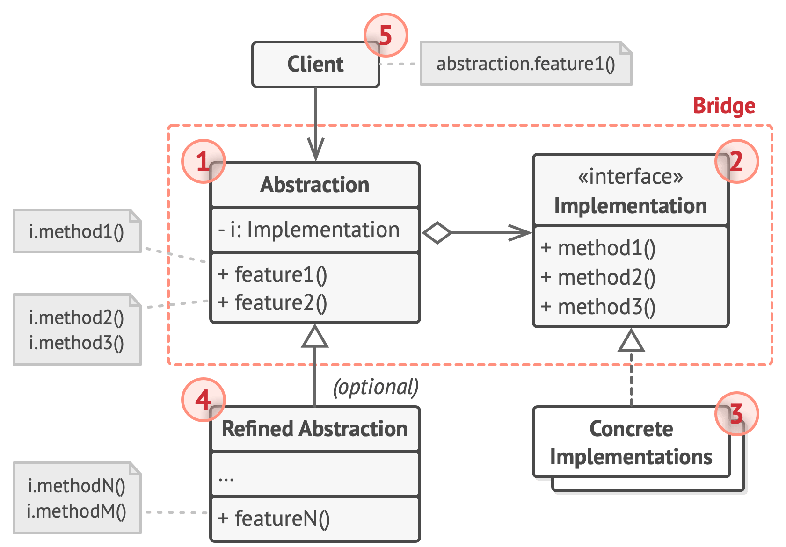

1. The Abstraction provides high-level control logic. It relies on the implementation object to do the actual low-level work.
2. The Implementation declares the interface that’s common for all concrete implementations. An abstraction can only communicate with an implementation object via methods that are declared here.

```
The abstraction may list the same methods as the imple-
mentation, but usually the abstraction declares some complex
behaviors that rely on a wide variety of primitive operations
declared by the implementation.
```
3. Concrete Implementations contain platform-specific code.
4. Refined Abstractions provide variants of control logic. Like their parent, they work with different implementations via the general implementation interface.
5. Usually, the Client is only interested in working with the abstraction. However, *it’s the client’s job to link the abstraction object with one of the implementation objects.*

#### Remote control and device example

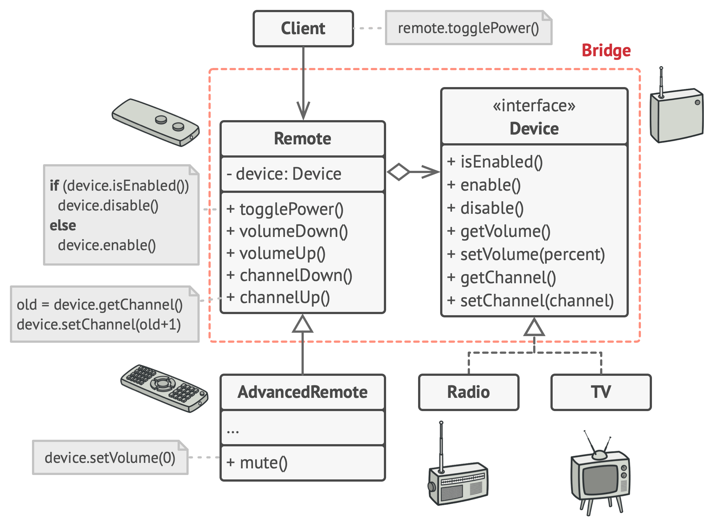

- The RemoteControl abstraction controls the Device implementation
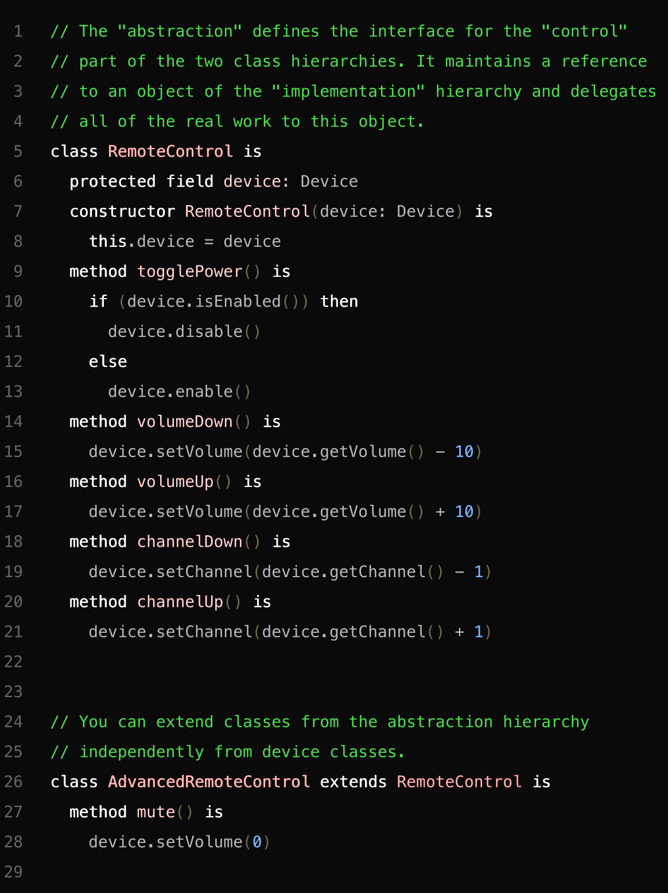


#### When to use bridge pattern

```
Use the Bridge pattern when you want to divide and organize
a monolithic class that has several variants of some functionality 
(for example, if the class can work with various database servers).

Use the pattern when you need to extend a class in several
orthogonal (independent) dimensions.

Use the Bridge if you need to be able to switch implementations at runtime.
Although it’s optional, the Bridge pattern lets you replace the
implementation object inside the abstraction. It’s as easy as
assigning a new value to a field.

Don't confuse bridge with strategy pattern, even though they seem similar.
```

#### Pros and cons

```
Pros:

You can create platform-independent classes and apps.

The client code works with high-level abstractions. It isn’t
exposed to the platform details.

Open/Closed Principle. You can introduce new abstractions and
implementations independently from each other.

Single Responsibility Principle. You can focus on high-level logic
in the abstraction and on platform details in the implementa-
tion.

Cons:

You might make the code more complicated by applying the
pattern to a highly cohesive class.
```

### 3. Composite

**Composite is a structural design pattern that lets you compose objects into tree structures and then work with these structures as if they were individual objects.**

- Using the Composite pattern makes sense *only* when the core model of your app can be represented as a tree.
- In the example with products and boxes that can contain products, the solution would look as follows:

```
The Composite pattern suggests that you work with Products
and Boxes through a common interface which declares a
method for calculating the total price.

How would this method work? For a product, it’d simply return
the product’s price. For a box, it’d go over each item the box
contains, ask its price and then return a total for this box. If
one of these items were a smaller box, that box would also
start going over its contents and so on, until the prices of all
inner components were calculated. A box could even add some
extra cost to the final price, such as packaging cost.

The greatest benefit of this approach is that you don’t need to
care about the concrete classes of objects that compose the
tree. You don’t need to know whether an object is a simple
product or a sophisticated box. You can treat them all the same
via the common interface. When you call a method, the objects
themselves pass the request down the tree.

Its usually the leaf elements that are performing the core logic.
```

#### Structure

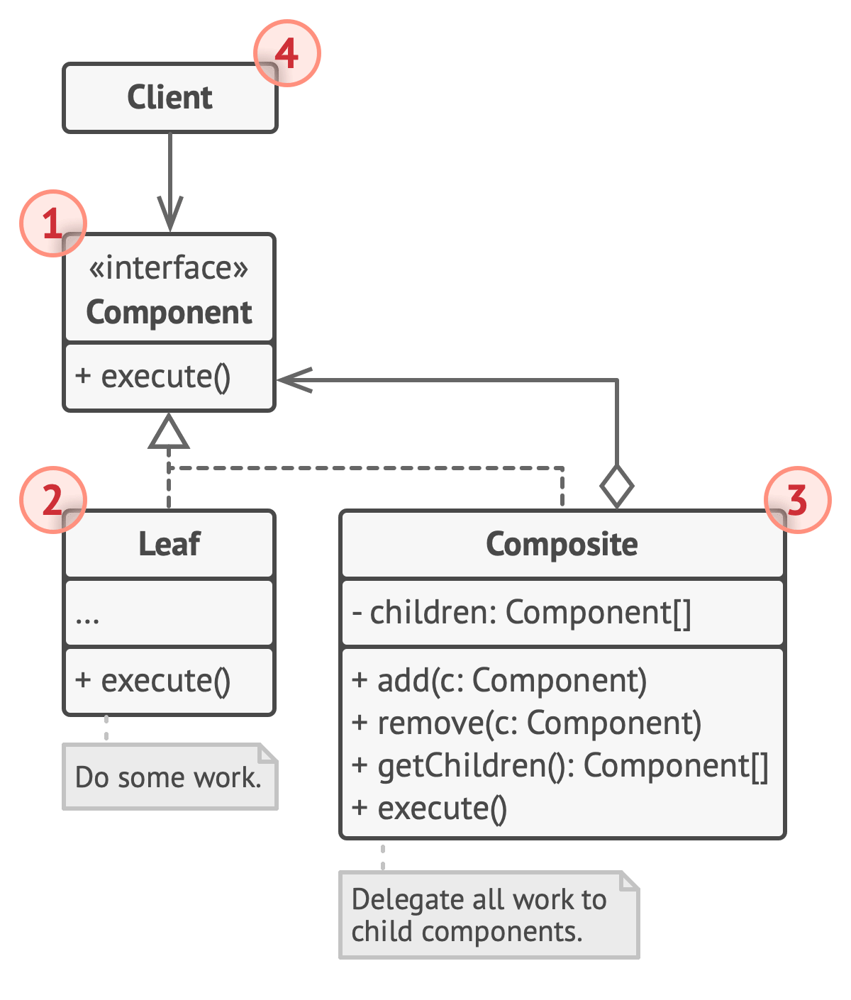

1. The Component interface describes operations that are common to both simple and complex elements of the tree.
2. The Leaf is a basic element of a tree that doesn’t have sub-elements.

```
Usually, leaf components end up doing most of the real work,
since they don’t have anyone to delegate the work to.
```

3. The Container (aka composite) is an element that has sub-elements: leaves or other containers. A container doesn’t know the concrete classes of its children. It works with all sub-elements only via the component interface.
4. The Client works with all elements through the component interface. As a result, the client can work in the same way with both simple or complex elements of the tree.

#### When to use composite pattern

```
Use the Composite pattern when you have to implement a
tree-like object structure.

Use the pattern when you want the client code to treat both
simple and complex elements uniformly.
```

#### Pros and cons

```
Pros

You can work with complex tree structures more conveniently:
use polymorphism and recursion to your advantage.

Open/Closed Principle. You can introduce new element types
into the app without breaking the existing code, which now
works with the object tree.

Cons

It might be difficult to provide a common interface for class-
es whose functionality differs too much. In certain scenarios,
you’d need to overgeneralize the component interface, making
it harder to comprehend.
```

### 4. Decorator

**Decorator is a structural design pattern that lets you attach new behaviors to objects by placing these objects inside special wrapper objects that contain the behaviors.**

